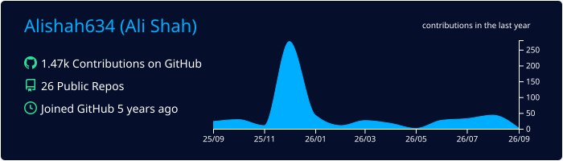
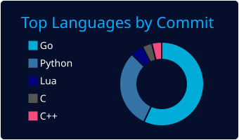
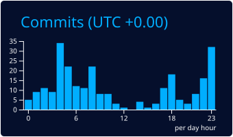

# Ali A. Shah 👋

<!--
**Alishah634/Alishah634** is a ✨ _special_ ✨ repository because its `README.md` (this file) appears on your GitHub profile.
-->
## About Me
I love being an engineer. Problem solving and learning is what I love. I'm just generally curious and being an engineer lets me hone my curiosity into tangible and useful projects. 

### 📊 Stats
---
<!-- 
 -->
<!--    -->
<!-- 
 -->
<!---->
<!-- 
 -->
<!--    -->
<!-- 
 -->
<!---->
<!-- 
 -->
<!--    -->
<!-- 
 -->

## What I'm Up To
* **🔭 I’m currently working on:** Doberman, an open-source MCP proxy providing runtime security guardrails to protect AI agents from prompt injection and block data exfiltration.
* **🌱 I’m currently learning:** Reverse engineering, operating system (review), PCB design and refreshing my knowledge on LLM architecture.
* **👯 I’m looking to collaborate on:** Open-source hardware/software security projects. 
* **🤔 I’m looking for help with:** Gaining more Cybersecurity experience.
* **💬 Ask me about:** My Linux homelab architecture, engineering flight control firmware for single motor thrust-vector drones, or developing automated CI/CD grading infrastructures and optimizing custom Lua configurations in Neovim.
* **📫 How to reach me:** You can reach me via email at ali.a.shah.work@gmail.com or connect with me on LinkedIn at [linkedin.com/in/syed-ali-shah01/](https://linkedin.com/in/syed-ali-shah01/).
* **😄 Pronouns:** He/Him
* **⚡ Fun fact:** I engineered a 10-inch single-motor drone that relies on continuous rotation and real-time computer vision (SIFT/RANSAC) to de-rotate the live video feed for the pilot! When I'm away from a keyboard, you can usually find me working on personal projects, playing chess, lumosity games, or cooking.
